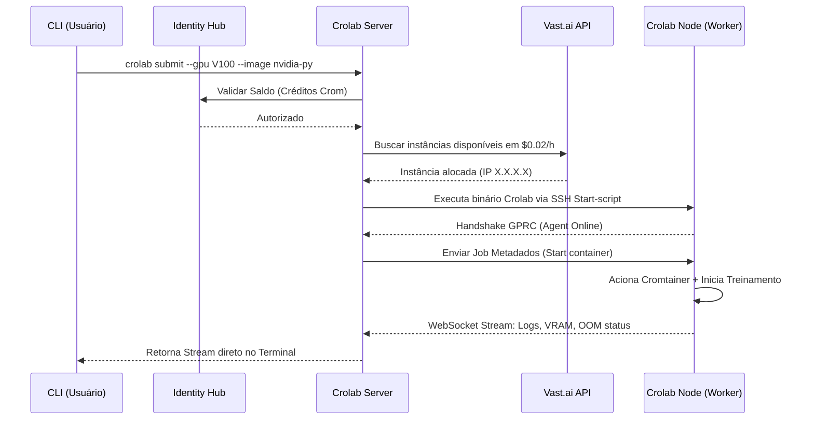

# A Trindade da Arquitetura Crolab

A arquitetura do Crolab foge do modelo acoplado monolítico web em favor de um ecossistema construído primariamente em linguagem Go. O motivo para o uso do Go é sua latência microscópica, suporte inigualável a concorrência (Goroutines) e facilidade de compilação cruzada como binário estático.

O sistema é formado por três binários (A Trindade):

## 1. Crolab Server (A Mente Mestra)
O Orquestrador central que roda na nuvem ou no painel da infraestrutura Crom.
- **Função Core**: Gerencia as requisições de clientes, monitora a malha de Nodes ativos, efetua conciliações financeiras e interage com APIs externas (Identity Hub, Vast.ai).
- **Stacks Técnicas**: Escrito em Go utilizando frameworks de alta performance como Fiber ou Echo para expor a API de controle (REST ou gRPC) e WebSockets para o túnel reverso.

## 2. Crolab Node / Agent (O Motor Invisível)
O serviço invisível operando em camada infra. Instalável num PC na Estônia ou no seu servidor locado ("The Tank").
- **Função Core**: Instancia o Docker daemon, reporta o "heartbeat" e as capacidades da GPU (temperatura, memória livre), baixa os pacotes via Crompressor e efetua a computação solicitada.
- **Stacks Técnicas**: Daemons escritos em Go sem dependências externas; Comunicação persistente via gRPC bidirecional para transpor NAT/Firewalls; Motor de isolamento ativado sob demanda.

## 3. Crolab CLI (A Arma de Execução)
A interface amada por engenheiros de software.
- **Função Core**: Compõe o elo entre o desenvolvedor local e a nuvem de forma nativa. O usuário fará comandos como `crolab auth`, `crolab nodes list`, `crolab submit --gpu A100 main.py`.
- **Extensibilidade**: A funcionalidade modular baseada em CLI permite plugar facilmente em uma extensão visual do Visual Studio Code. A UI (independente se em React ou Vue) consome a mesma API subjacente que originou a CLI.

## Fluxo de Execução de um Job

## Por que 3 binários em invés de um backend monolítico via Web?
Para alcançar "Invisibilidade". Um modelo puramente web obriga manter *polling*, e falha ao acessar hardware diretamente (monitoramento nativo de processos da placa de vídeo via nvml/smi). O Crolab Node será capaz de parar treinos preemptivamente (early stop condition vinda do SRE) antes que os recursos financeiros daquele pipeline sejam esgotados.
