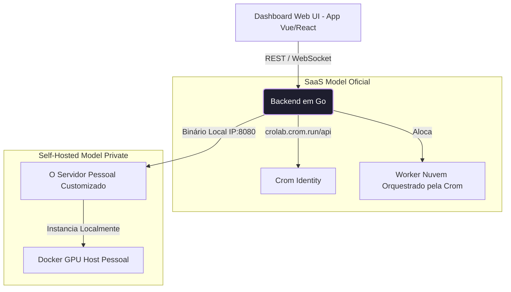

# Crolab: Visão da Web UI e Frontend (Estilo Colab)

## 1. O Próximo Nível Pós-MVP
Uma vez que o binário core da Crolab (Node, Orchestrator e CLI) provar estabilidade matemática e resiliência ao gerenciar sessões interativas de Docker puramente via terminal, a arquitetura dará a luz a Frontend Web moderno.

A transição será cristalina e indolor, pois a arquitetura prevê que o Web Frontend consumirá exatamente as mesmas rotas e canais WebSocket/API que a `crolab-cli` já devora nativamente.

## 2. Hospedagem Híbrida (SaaS & Soberania Self-Hosted)
Esta IU deve ser agnóstica de provedor e oferecer liberdade dual:
- **Cloud Centralizada (`crolab.crom.run`)**: O serviço oficial do Painel Crolab onde o usuário loga via Auth da Identity, gerencia seus saldos, recarrega carteira e submete código às opções de instâncias providas e encarecidas com spread pela Crom.
- **Hospedagem Privada (Self-Hosted)**: Entregue "de brinde" embutido no próprio sistema. Ao rodar `crolab-node serve --web`, o cliente lança seu próprio servidor Dashboard no IP privado em que instalou a ferramenta (Ex: Seu laboratório). Ele acessa a UI em `localhost:8080`, configura provedores paralelos sem passar por nossa auditoria financeira, detendo o controle absoluto.

## 3. Funcionalidades Core da "Dashboard UI"
Uma reprodução aprimorada das delícias de acessibilidade de um Google Colab, combinada com a gestão de multicloud da Vast:

- **Autenticação & Landing**: Home page de estado, faturamento (Créditos), overview de máquinas providas no seu cluster.
- **Central de Roteiro Multi-Cloud (CRUD Web)**: Telas para o usuário imputar as chaves de provedores como RunPod, colocar seu Servidor Pessoal (Nodes Custom) ou comprar das instâncias alocadas na pool da Crom.
- **O Laboratório de Código (Code Cells)**: Painel estilo Jupyter Notebooks embutido via projeto robusto Front-End (ex: base no Monaco Editor / Xterm.js).
  - Execução interativa (células bloco a bloco) com envio das requisições serializadas para a API binária.
  - Streaming WS Bidirecional do output nativo fluindo para os visuais do Front-end.
  - File-Explorer em árvore visual mostrando dados de `datasets` ou pesos resultantes, ativando link direto para download local.

## 4. Diagrama da Expansão Web

## 5. Posicionamento de Prioridades (Ideação Escalonada)
A anotação e documentação dessa frente inteira fica estipulada como estritamente Pós-MVP. Um front-end colossal como um Jupyter requer tratar lógicas infinitas de "cursor posicionado", "sessões interativas do Kernel Python" etc. O foco deve continuar sendo fundar os dutos do CLI-Node até que eles aguentem Terabytes sem flambar.
