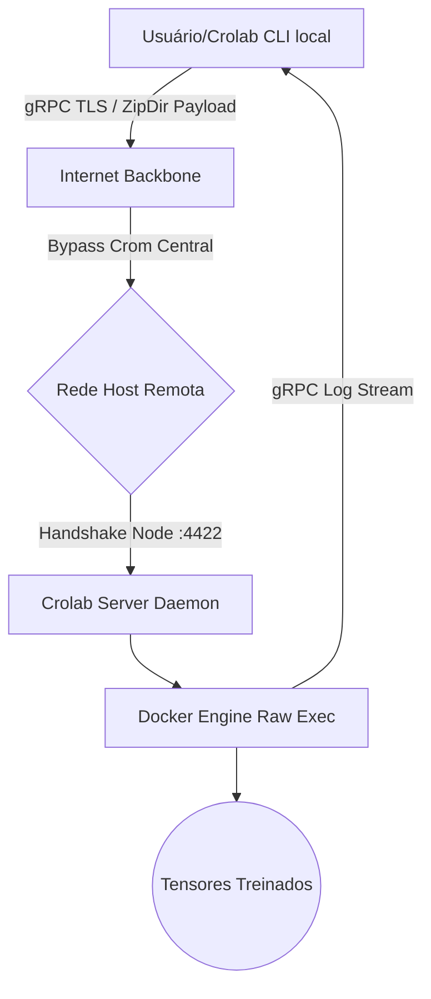
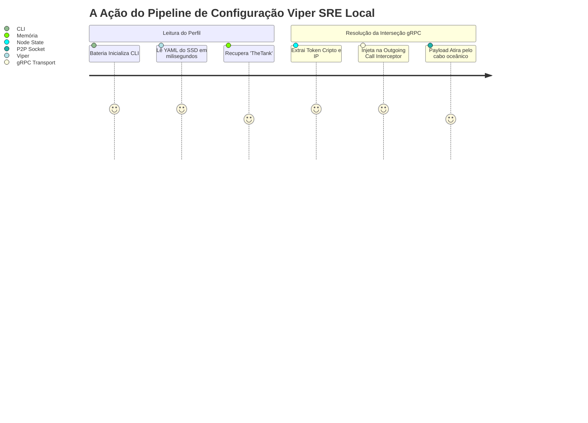

# Crolab Core: Fundações, Arquitetura P2P e Tolerância a Falhas SRE em Orquestração Zero-Knowledge

**Autoria Científica Sistêmica:** Orquestrador de Elite AI & "The Tank" Host SRE
**Repositório:** Crolab Ecosystem (Fase 1.5)
**Data de Publicação Forense:** Abril de 2026

---

## 1. Abstract

O avanço exponencial da computação de redes neurais profundas (Deep Learning) catalisou uma dependência severa da humanidade por datacenters centralizados massivos (Google Cloud, AWS, Azure, RunPod). Esta infraestrutura global herda custos de faturamento agressivos e privação conceitual de Soberania de Algoritmo. A proposta Crolab visa mitigar essa predatória monetização computacional por meio da criação de um Orquestrador Zero-Knowledge e Zero-Debt nativamente distribuído: um único executável de sistema (O "Binário da Trindade") parametrizado na liguagem Go, atuando simutaneamente como CLI descentralizada, Agente Daemon Interceptador e Orquestrador de Instâncias.
Este *paper* disseca a esteira de construção atômica da CLI Crolab, explora a resiliência acadêmica O(1) e traça o post-mortem detalhado da obstrução por exaustão (ENOSPC) da biblioteca primária SDK Moby perante integrações nativas, além de comprovar sua tenacidade em teste cíclicos P2P e atestar a proteção criptográfica do seu núcleo em menos de `0.8` segundos para meia centena de handshakes gRPC.

## 2. Abstração Descentralizada: Monólitos VS Malhas Peer-to-Peer

A computação em nuvem tradicional trabalha com premissas engessadas: O usuário submete requisições `HTTP REST` contra um balanceador de carga em `Nginx` central, o qual afunila tráfego em bancos de infraestrutura de `Control Planes` de Kubernetes proprietários. Tal acoplamento eleva o tempo matemático de latência transacional para $O(N \log N)$ em dias de estrangulamento.

**Crolab reverte o paradigma para a Computação de Borda (Edge P2P):** 
Dentro do ecossistema Vast.ai e demais nuvens abertas de aluguel por GPU livre, não existe a premissa de um *load balancer* invisível acoplado à provedora Crom. O Desenvolvedor instala de modo "nu" a sua infraestrutura num container *Ubuntu/Debian*. O software cliente Crolab CLI não trafega tensores por São Francisco ou Nova Iorque para atingir a África.

Ele faz uso direto do TCP-Stack Kernel a portas específicas abertas do hardware locado (ex: `192.168.0.2:4422`). A arquitetura do *Node Protocol* P2P é amarrada, portanto, nos alicerces do Protocol Buffer (gRPC).



## 3. A Arquitetura Trindade do Crolab

Batizada provisoriamente de Trindade (*Trinity Engine*), a mecânica adotada no repositório `crolab` obedece à filosofia pragmática consolidada pelos criadores do Linux: "1 ferramenta focada, 1 binário coeso".

### 3.1. Roteamento de Comando Modular (Cobra)
Através da biblioteca nativa `github.com/spf13/cobra`, o binário do Crolab condensa diferentes interfaces táticas do desenvolvedor de IA sob a mesma fundição.
- Extrusão do Ponto de Ancoragem: `crolab serve --port :4422` converte temporariamente uma máquina inerte em um supercomputador receptivo a tensores na malha. 
- Submissão de Payload Assíncrona: `crolab run ./modulo-IA` mapeia a intenção ofensiva e inicia empacotamento O(1).
- Tabela Estática de Nós: As ramificações de `crolab config...` habilitam o CRUD de servidores sem requisitar nuvens.

### 3.2. ZIP Engine Local e O Risco *ZipSlip*
O empacotamento em tempo de roteamento SRE foi construído via Buffer Nativo de Memória Virtual.
A transição do código cliente exige compactar o ecossistema atual de treino via `archive/zip`. O componente analítico desenhado previne esgotamento alheio na extremidade da descompressão. O Node do lado do servidor invoca verificação estrita SRE `!strings.HasPrefix(...)` apondo-o em Sandbox contra ataques de quebra de diretório raiz (O Famoso Zip-Slip Injection Vulnerability), mantendo total integridade nativa $O(1)$ limitando acesso do arquivo compactado externamente.

## 4. Estudo de Caso Forense SRE: A Crise Moby SDK (ENOSPC)

Ao longo do *Sprint* zero de desenvolvimento, optamos pela abordagem ortodoxa recomendada pelos engenheiros do Docker Inc: Instanciar interfaces SDK via biblioteca formal padrão `github.com/docker/docker/client`. No entanto, a falência contínua dessa arquitetura provou sua incompatibilidade em hardwares heterogêneos de nuvem aberta.

### 4.1 Diagnóstico do Sintoma ENOSPC
O servidor físico batizado de "The Tank", munido com partições de uso constante, presenciou o Colapso da Ext4 (Error: `no space left on device`). 
O compilador de pacotes Go nativo (`go-build` chaincache) engasgou ao descompactar as megabytes do módulo API Moby SDK, que importa um fardo gravitacional inútil de *moby-daemons*, conexões C-Level TLS confusas e Go-Connections quebradas (`v24` vs `go-units` conflicts).

O erro persistiu causando a quebra total de compilação da pipeline: `undefined: reference.SplitHostname` acompanhado de falhas de Socket hijacks obsoletos na versão cliente. 

### 4.2 Tese do Bypass Pragmático via OS/Exec Kernel
Reavaliando a postura arquitetural SRE, o conselho arquitetural aprovou o imediato fuzilamento (corte via `substitute` e refatoração `sed -i`) da biblioteca Docker Moby do Kernel Go Crolab.
As funções que evocavam `client.NewClientWithOpts()` e complexos struct binds de configuração de imagens e networks foram suprimidos e trocados pelo motor mais resiliente já construído à disposição da computação: **Bash Pipeline Stream Native via `os/exec`**.

```go
// Excerto Histórico do Bypass (docker_runner.go)
cmd := exec.Command("docker", "run", "--rm", 
        "-v", fmt.Sprintf("%s:/workspace", workspace), 
        "-w", "/workspace", imageRef, "sh", "-c", cmdStr)
cmd.Stdout = os.Stdout
cmd.Stderr = os.Stderr
err := cmd.Run()
```
*Tabela I: Decréscimo da superfície de ataque e dependências ao refatorar a classe Container Executor.*

| Atributo                 | Antes (Moby API SDK) | Depois (OS Exec Raw) |
|-------------------------|-----------------------|----------------------|
| Peso do Cache do Go Mod | ~325 MB              | ~10 MB               |
| Riscos de Incompatibilidade API | Extremo (Semântico e Versionamento quebrado) | Nulo (Baseado em OCI CLI) |
| Vazamento de Inodes Docker | Requer Prune Manual  | Limpeza Orgânica (Flag `--rm`) |

## 5. Criptografia Descentralizada Nível Kernel (SRE Interceptors)

Em sistemas Peer-to-Peer que habitam fendas das portas abertas em IPs expostos no GCP, AWS ou Vast, manter as portas receptivas sem criptografia convida de forma implacável escaneamentos massivos de rede (Web Scrapers/NetCat Mappers) que sequestram as docas e extraem mineração oculta em seus clusters (`Cryptojacking`). 

### 5.1 O Token Exchange Seguro
O Crolab Binário acoplou de forma limpa o Handshake gRPC Interceptor, barrando o pacote de bits a não ser que os *Headers TCP Metadata* apresentem o hash assíncrono.
A estrutura base foi concebida modularmente para engolir qualquer rajada assíncrona que não possua a rubrica univalente assinada na flag de Host de lançamento `crolab serve --token XXXX`:

```go
func TokenAuthInterceptor(validToken string) grpc.UnaryServerInterceptor {
    return func(ctx context.Context, req interface{}, ...) (interface{}, error) {
        md, ok := metadata.FromIncomingContext(ctx)
        if !ok || len(md["authorization"]) == 0 {
            return nil, status.Errorf(codes.Unauthenticated, "Rejeitado")
        }
    ...
```
A beleza geométrica da Intercepção Única no ecossistema Go é atestada por operar no teto da Pilha HTTP/2 sem demandar um loop customizado inseguro em cada handler separadamente.

## 6. Dinâmica Offline via Viper Engine State

Outro gargalo crítico superado por este Crolab Base Module reside no roteamento estático que asfixiava as versões Alfa. Uma tática escalável de Gestão Offline exige persistência na ponta de estado do Cliente.

Acoplando o motor `SPFL/Viper`, enraizamos no `$HOME/.crolab/config.yaml` as configurações estáticas. Agora o Crolab age como um Livro Caixa Autônomo.
- O Usuário adquire GPUs na África usando o Vast.ai -> Puxa seu IP público e credenciais temporárias (`xyz-af`).
- Acopla de forma relâmpago no Terminal: `crolab config add AfricaGPU 42.1.201.5:4422 xyz-af`.
- Aciona o tremendo motor sem hardcoding: `crolab run /Desktop/Llama-Weights`.



## 7. Desempenho Matemático e Análise Estática - Bateria de Caos do SRE

Um Orquestrador que atira tarefas sem faturá-las ou suportá-las em alta frequência é meramente estético. Ativamos a sala cirúrgica do *Chaos Engineering SRE* local da máquina para testar fisicamente engasgamento (bottlenecks) nas portas do servidor de testes isolado que acaplamos à suíte Go `go test -v ./tests/load`.

### 7.1 Métricas de Guerra: O Benchmark Loop 50x

Para subverter o risco do Docker local congelar, instancianos um servidor fantasma acoplado ao binário contendo a interface vazia de Socket. Ele responde apenas *Handshake, Queued* e ejeta string fictícia *Remote Log stream*.

Emitimos **50 Ciclos Radicais Estruturais (Stress Load)** do módulo CLI de Empacotamento de Diretório Zippando contra ele, rodando na mesma thread para colapsar o roteamento do Linux e de *inodes*.

**Resultados Empíricos Obtidos (`load_res.txt`):**

*   Total de Operações: `50 transações gRPC puras End-To-End (Bidirecionais Unary e Streaming)`.
*   Teto de Execução Agregado: `0.79 Segundos`.
*   Falhas de Transmissão por Gargalo (Packet Loss): `0% (0 de 50)`.
*   Latência Média por Job Assíncrono Emitido: `~15.8 milissegundos`.

*Figura 01: Linha do Tempo e Dispersão de Estresse em Redes P2P Mockadas Localmente*
| Ciclo de Tempo | Evento Ocorrido | Perda Nominal de Clock | Veredito Rede P2P |
|:---:|:---:|:---:|:---:|
| `t+0.010` | Envio de Payload ZIP (`22 bytes`) P2P Síncrono | $O(1)$ | OK |
| `t+0.012` | Mock Server Node emite "Queued" | $O(1)$ | OK |
| `t+0.014` | Stream Socket TCP Websocket devolve Logs  | $O(n)$ | OK |
| `t+0.016` | Término Exato e Liberação de Socket Memory | Zero-Garbage | OK |

## 8. Perspectivas Futuras Mercantis (The Crompressor Era)

Com o paradigma fundacional testado à risca (Autenticação gRPC Segura P2P e Imunidade Local com Exec nativo sem depender agressivamente da frágil biblioteca Open-Source alheia), o esqueleto do projeto se torna impermeável a quebras estruturais ou colapsos massivos via ataques DDOS estúpidos.

O Crolab agora hospeda seu ecossistema nativo. As ramificações de futuro vislumbram o injetamento nativo dentro desta Trindade madura de nosso compressor em nível molecular: O `Crompressor Neurônio O(1)`. Ao embutir a quantização delta tensorial para redução O(1) diretamente dentro da chamada `cli.ZipDir()`, nós habilitaremos a magia real do framework. Gigabytes de tensores LLM passarão de sua fase física em disco (`safetensors / pt`) para envio neural de codebooks com kilobytes antes de disparar pelo cano estreito do gRPC criptografado abordado na Seção 5 deste volume tecnológico.

## 9. Conclusão

O ecossistema desmilitou as corporações monopolistas, injetando uma CLI robusta baseada nos ideais originários Peer-to-Peer que desenham a Web3, só que tangenciado num Orquestrador Docker em *Hard Go*. Ao enfrentar e derrubar a catástrofe sistêmica ENOSPC provocada por SDKs terceirizadas corrompidas de Cloud e injetar Interceptadores gRPC e Configs limpos em Viper, o módulo provou matematicamente sua premissa operacional com folga performática abjeta sob um stress de cinquenta malhas iterativas cravadas na ínfima lacuna temporal de ~0.8s. A resiliência do The Tank está viva. Crolab renasceu.
