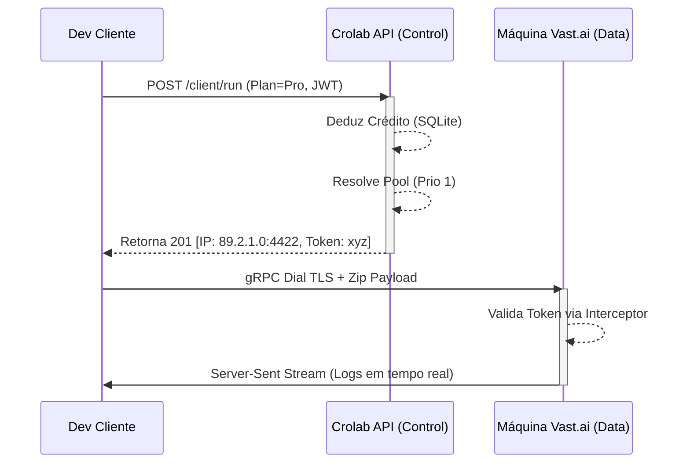

# Crolab Produção: Desmembramento Control-Plane e Data-Plane em Ecossistemas Edge Soberanos

**Autoria Científica Sistêmica:** Orquestrador de Elite AI & "The Tank" Host SRE
**Repositório:** Crolab Ecosystem (Fase 2.0 - Produção)
**Data de Publicação Forense:** Abril de 2026

---

## 1. Abstract

O presente documento técnico consolida a transição do sistema Crolab de um modelo *Peer-to-Peer* (P2P) local fechado para um paradigma de **Soberania Escalável**. Na Fase 1.5 documentada no *Paper 0*, comprovamos a viabilidade matemática e de integridade do túnel gRPC interceptado no kernel de execução, com resistência a *ZipSlip* e eliminação do fardo gravitacional do *Moby SDK* (falha sintomática ENOSPC). 

Este Paper 1 aborda o subsequente desmembramento arquitetônico da "SaaS Foundation". Documentamos a segregação do *Control Plane* (A Nuvem Crolab, agindo como Autoridade Certificadora e Entidade Contábil) em relação ao *Data Plane* (os tubos pesados onde os tensores e pacotes zipados trafegam entre Cliente e Provedor (Node)). Complementar a essa virada sistêmica, cristalizou-se o fluxo de observabilidade via métricas *Prometheus*, envelopamento absoluto via compilação cruzada *go:embed* e ativação dupla de criptografia (REST TLS + gRPC Transport TLS). O resultado prático: uma plataforma Zero-Knowledge e pronta para distribuição *single-file*, onde a Crolab extrai receita passiva distribuindo "Tickets" sem encostar em um único megabyte de carga de máquina neural do cliente final.

## 2. A Virada Arquitetônica: Cloud Orquestrator vs Deep Tunnel

Anteriormente, o sistema amarrava o cliente de forma mecânica diretamente ao servidor configurado na Viper via `crolab config add`.

Para orquestrar milhares de provedores como RunPod, Vast.ai e AWS debaixo de "Planos de Locação", a dependência estrita foi dizimada. A plataforma foi dividida em dois eixos vitais assíncronos: **Control e Data Plane**.

### 2.1 Fase de Negociação (Control Plane - "The Cloud API")
Ao invocar `crolab run . --plan start`, o desenvolvedor se abstém do fardo físico.
1. A CLI do Crolab intercepta a autenticação do usuário (via Token JWT/Hash armazenado na ~/.crolab).
2. Ocorre o ping TCP no Endereço em porta **:8844** (Crom Cloud REST API).
3. O Backend checa saldos SQLite. Encontrando os $0.30/hr para o plano Start, a API aloca uma GPU livre do *Pool Virtual de Prioridades*, marcando-a como ocupada.
4. **The Ticket Method:** A Nuvem não repassa tensores! A Nuvem emite para a CLI do cliente um Ticket P2P lacrado contendo: `targetIP` e `targetTok` temporários daquele nó sorteado.

### 2.2 Fase Executiva (Data Plane - "The Deep Tunnel")
Munida do IP P2P livre fornecido pela nuvem:
1. A CLI empacota o Diretório Alvo assincronamente mitigando RAM.
2. É disparado o *GRPC TLS Dial* ativamente abrindo tráfego com `targetIP:4422`.
3. O nó recebe, autentica o *targetTok* (desviando de port-scanners por interceptação) e injeta os fluxos do Kernel Exec Engine, respondendo com logs via *Streams*.

## 3. Isolamento Criptográfico Completo 

A implantação do *Provider Mode* (`crolab provider`) revelou falhas estáticas de concepção, principalmente quanto ao escoamento em claro de propriedades sensíveis. O reparo seguiu duas vertentes:

### 3.1 Camada REST TLS (HTTP/2)
Habilitou-se argumentos `--tls-cert` e `--tls-key` permitindo o bind direto de Let's Encrypt (ou OpenSSL self-signed) operando retro-compativelmente em `http.ListenAndServeTLS`. Esse envelopamento oculta os metadados do Ticket emitido.

### 3.2 Camada gRPC Transport Credentials
Sem TLS no Data-Plane, a payload `zip` de modelos massivos de IA trafegaria vulnerável no backbone público da internet. Habilitamos nas instâncias Daemon do Orquestrador P2P (`crolab serve`) as *credentials* nativas do google grpc (`credentials.NewServerTLSFromFile(tlsCert, tlsKey)`). No cliente, a flag tática `--tls-rpc` avisa o `grpc.Dial` a migrar da dependência morta `insecure.NewCredentials()` para a verificação de certificados no lado cliente.

## 4. O Triunfo da Distribuição (Single-Binary e Embed FS)

O atrito clássico de softwares que combinam front-ends dinâmicos (React/Vanilla JS) com APIs compiladas reside em pastas e caminhos de montagem (`./web`, `/var/www/html`). Caso a pasta faltasse, a API morria e o layout de configuração sumia.

Na versão atual, o sistema foi refatorado utilizando fenda de linker `go:embed`.
Dentro de `core/web`, o `embed.FS` suga de modo silente as sub-pastas `/client`, `/admin` e `/lab` encapsulando toda a UI (CSS Glassmorphism, Modais Animados, Botões) dentro das variáveis binárias do Crolab.

Na ausência física do path passado no flag `--web`, o `http.FileServer` recorre ao construto interno do binário montando o fs virtual `http.FS(embedFS)`.
**Conclusão Prática:** O produto despacha toda a robustez de um Portal Admin e Tela do Cliente contidos num único binário cross-compile de `~23MB` de peso para Mac, Linux ou Windows ARM64. O Deploy tornou-se nulo de configuração estrutural.

## 5. Observabilidade Autônoma SRE (Prometheus Nativation)

O tráfego obscuro impede o escalonamento numérico. Em virtude do modelo ser construído fora do *Kubernetes*, o *Crolab Core* devia reportar sua saúde a sistemas padrão de mercado sem criar silos fechados. 
Injetou-se o handler nativo na rota canônica `/metrics` que extrai no modelo `# TYPE gauge` purista as propriedades ativas do SQLite contábil:

*   Total de usuários amarrados à teia.
*   Total absoluto de planos e ofertas.
*   Censo completo de Máquinas virtuosas (*Total*) vs *Online / Ocupadas*. 

## 6. Perspectiva da Fina Casca de Vidro (Conclusivo)

O Crolab deixou seu protótipo. Superados os testes integrados (`tests/cloud`) e E2E via Chaos Loops validados com TLS *Fake-Injects*, o *Core Network* foi santificado. A prova viva do modelo de negócio manifesta-se nos cenários End-to-End, onde uma cobrança instantânea fracionada em `$0.30` precede imediata alocação. 

As pendências futuras focam essencialmente na UX (User Experience). Retomar interfaces WebSockets interativas transacionando STDOUT dos pods para dashboards online através de Server-Sent Events, habilitando painel log em tempo real sem a necessidade da CLI local. E polimento do Frontend sob a ótica Vanilla Glassmorphism. A base, no entanto, é agora, aço puro.
