# Relatório Forense CLI & Web Automatizado

Este relatório foi gerado algoritmicamente executando a suíte E2E nativa do Crolab.
O cliente Web agora conta com SSO sincronizado via Local Token "~/.crolab/config.json".

## 1. Módulos Core P2P (CLI)

### Core & Autenticação
```text
$ crolab --help
Crolab — Orquestrador P2P de GPU para IA

Usage:
  crolab [command]

Available Commands:
  admin       Comandos administrativos (planos, pool, máquinas, usuários)
  auth        Autenticação com a Crom Cloud
  billing     Faturamento e créditos Crom Cloud
  cloud-serve Gerencia o servidor Central Cloud API
  completion  Generate the autocompletion script for the specified shell
  config      Gerencia servidores conectados
  connect     Conectar máquina pessoal
  db          Gerencia persistência de dados (Backups, Snapshots SQLite)
  help        Help about any command
  lab         Abre o Crolab Lab — editor web com execução de scripts
  monitor     Abre o dashboard interativo no terminal
  my-machines Listar máquinas pessoais conectadas
  plans       Ver planos disponíveis
  provider    Inicia modo provedor (admin + client em portas separadas)
  run         Envia código para execução via Crolab Cloud
  serve       Gerencia o Crolab Node (daemon gRPC que executa jobs)
  status      Mostra o estado local do Crolab (config, GPUs, versão)
  subscribe   Assinar um plano
  version     Mostra a versão do Crolab
  web         Gerencia o Portal Web interface

Flags:
  -h, --help      help for crolab
  -v, --version   version for crolab

Use "crolab [command] --help" for more information about a command.

```
```text
$ crolab auth --help
Autenticação com a Crom Cloud

Usage:
  crolab auth [command]

Available Commands:
  login       Login na Crom Cloud
  register    Criar conta na Crom Cloud

Flags:
  -h, --help   help for auth

Use "crolab auth [command] --help" for more information about a command.

```
```text
$ crolab auth login --help
Login na Crom Cloud

Usage:
  crolab auth login <email> <password> [flags]

Flags:
  -h, --help   help for login

```
```text
$ crolab auth register --help
Criar conta na Crom Cloud

Usage:
  crolab auth register <email> <password> [flags]

Flags:
  -h, --help   help for register

```
### Configuração de Provedores
```text
$ crolab config --help
Gerencia servidores conectados

Usage:
  crolab config [command]

Available Commands:
  add         Adiciona ou atualiza um servidor
  ls          Lista servidores em ordem de prioridade
  rm          Remove um servidor
  set-default Define o servidor padrão

Flags:
  -h, --help   help for config

Use "crolab config [command] --help" for more information about a command.

```
```text
$ crolab config add --help
Adiciona ou atualiza um servidor

Usage:
  crolab config add <nome> <ip:porta> [token] [flags]

Flags:
  -h, --help              help for add
      --priority int      Prioridade (1 = mais alta) (default 1)
      --provider string   Provedor (local, vastai, runpod, aws...) (default "local")

```
```text
$ crolab config ls --help
Lista servidores em ordem de prioridade

Usage:
  crolab config ls [flags]

Flags:
  -h, --help   help for ls

```
### Tenant & Consumo Client
```text
$ crolab subscribe --help
Assinar um plano

Usage:
  crolab subscribe [planID] [flags]

Flags:
  -h, --help            help for subscribe
      --server string   Servidor (default "http://localhost:8855")
      --token string    Token de autenticação

```
```text
$ crolab my-machines --help
Listar máquinas pessoais conectadas

Usage:
  crolab my-machines [flags]

Flags:
  -h, --help            help for my-machines
      --server string   Servidor (default "http://localhost:8855")
      --token string    Token

```
```text
$ crolab run --help
Envia código para execução via Crolab Cloud

Usage:
  crolab run [diretório] [flags]

Flags:
      --cmd string       Comando a executar (default "ls /workspace")
  -h, --help             help for run
      --image string     Imagem Docker (default "python:3.11-slim")
      --machine string   ID (ou Nome) da máquina específica
      --plan string      ID do Plano para Cloud routing (ex: start, pro)
      --tls-rpc          Usa TLS para conexão gRPC P2P

```
```text
$ crolab lab --help
Abre o Crolab Lab — editor web com execução de scripts

Usage:
  crolab lab [diretório] [flags]

Flags:
  -h, --help          help for lab
  -p, --port string   Porta do Lab (default ":8855")

```
```text
$ crolab monitor --help
Abre o dashboard interativo no terminal

Usage:
  crolab monitor [flags]

Flags:
  -h, --help   help for monitor

```
### Operador Core P2P
```text
$ crolab provider --help
Inicia modo provedor (admin + client em portas separadas)

Usage:
  crolab provider [command]

Available Commands:
  start       Sobe o Provider Node (use -d para rodar em background)
  stop        Desliga um Provider Node rodando em background

Flags:
  -h, --help   help for provider

Use "crolab provider [command] --help" for more information about a command.

```
```text
$ crolab admin --help
Comandos administrativos (planos, pool, máquinas, usuários)

Usage:
  crolab admin [command]

Available Commands:
  machines    Listar máquinas
  metrics     Ver métricas do dashboard
  plan        Gerenciar planos
  pool        Gerenciar pool de prioridade
  users       Listar usuários

Flags:
  -h, --help            help for admin
      --server string   Endereço do servidor admin (default "https://api.crom.cloud")
      --token string    Token de autenticação admin

Use "crolab admin [command] --help" for more information about a command.

```
```text
$ crolab admin plan --help
Gerenciar planos

Usage:
  crolab admin plan [command]

Available Commands:
  create      Criar plano
  delete      Remover plano
  list        Listar planos

Flags:
  -h, --help           help for plan
      --token string   Token admin

Global Flags:
      --server string   Endereço do servidor admin (default "https://api.crom.cloud")

Use "crolab admin plan [command] --help" for more information about a command.

```
```text
$ crolab admin pool --help
Gerenciar pool de prioridade

Usage:
  crolab admin pool [command]

Available Commands:
  add         Adicionar entrada ao pool
  list        Listar pool de um plano

Flags:
  -h, --help           help for pool
      --token string   Token admin

Global Flags:
      --server string   Endereço do servidor admin (default "https://api.crom.cloud")

Use "crolab admin pool [command] --help" for more information about a command.

```
```text
$ crolab admin users --help
Listar usuários

Usage:
  crolab admin users [flags]

Flags:
  -h, --help   help for users

Global Flags:
      --server string   Endereço do servidor admin (default "https://api.crom.cloud")
      --token string    Token de autenticação admin

```
```text
$ crolab admin machines --help
Listar máquinas

Usage:
  crolab admin machines [flags]

Flags:
  -h, --help   help for machines

Global Flags:
      --server string   Endereço do servidor admin (default "https://api.crom.cloud")
      --token string    Token de autenticação admin

```


## 2. Testes de Renderização
As imagens renderizadas capturam o dashboard renderizado com precisão Single-Binary:

### Visão Headless: Mode Client
- **Home:** 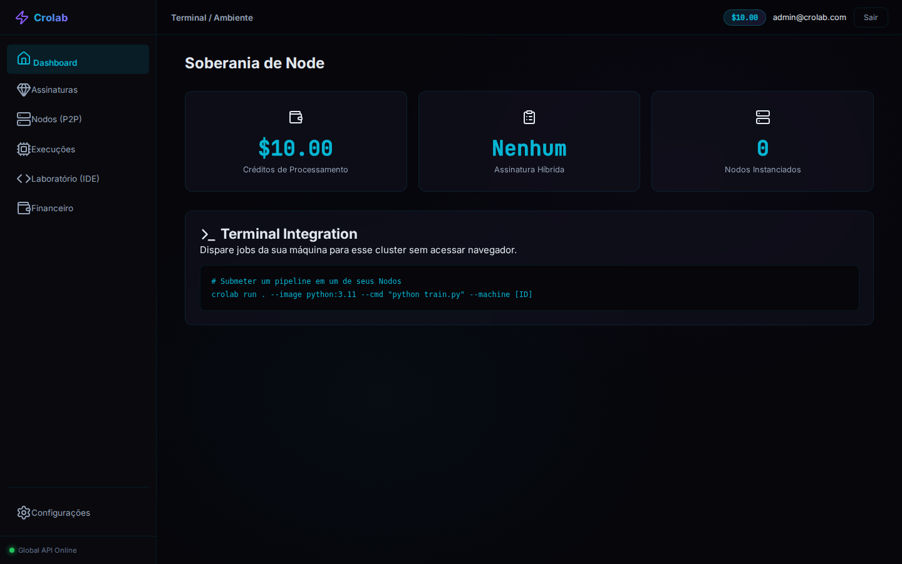
- **Editor Colab-Style (IDE):** 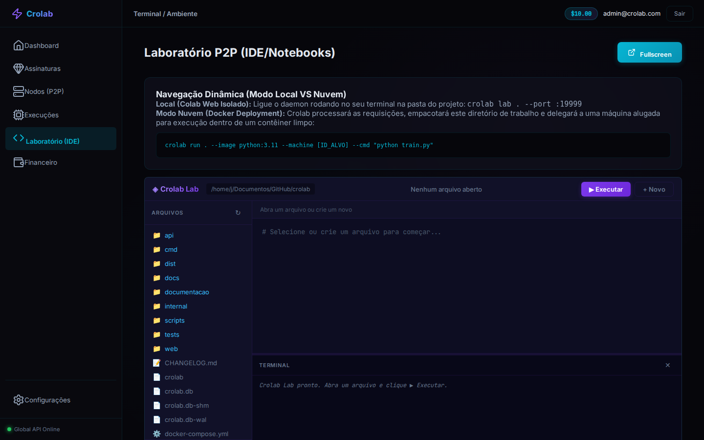
- **Planos Contratados:** 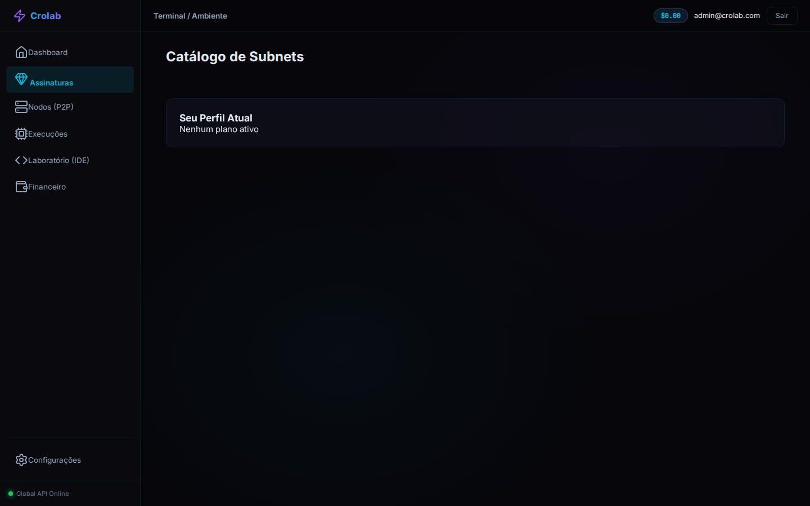
- **Máquinas Associadas:** 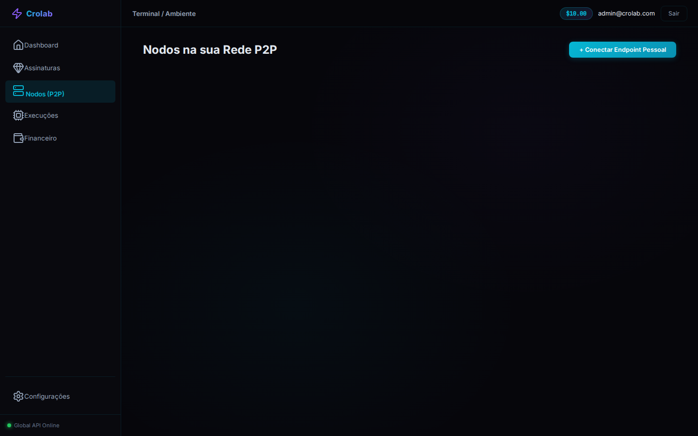
- **Jobs Executados:** 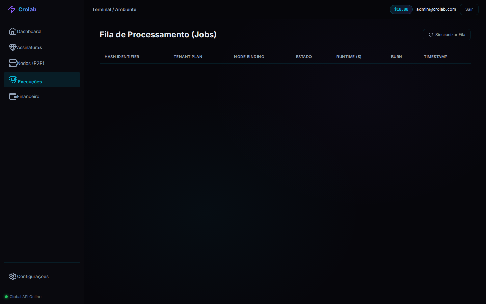
- **Faturamento/Créditos:** 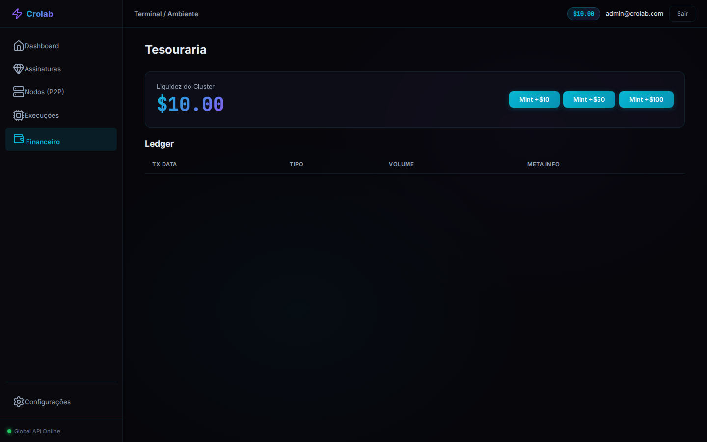

### Visão Headless: Mode Admin
- **Dashboard Overview:** 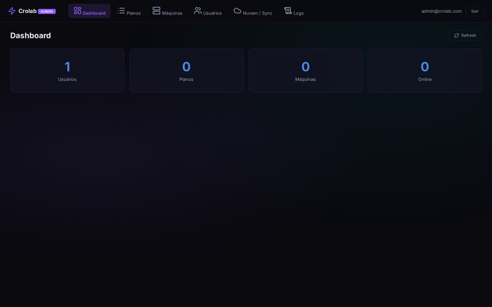
- **Planos Globais:** 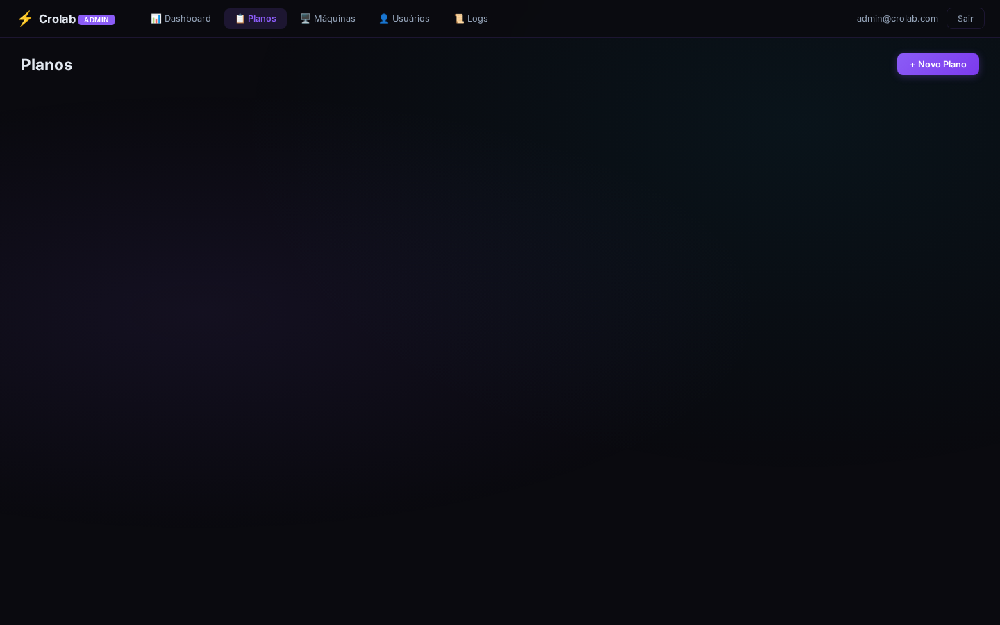
- **Máquinas Conectadas:** 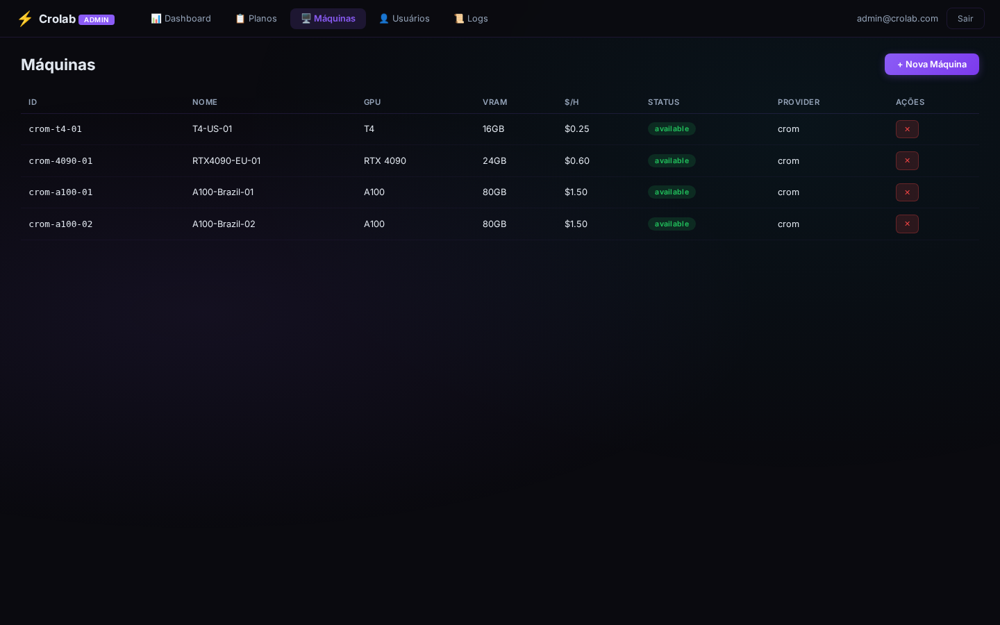
- **Usuários Tenants:** 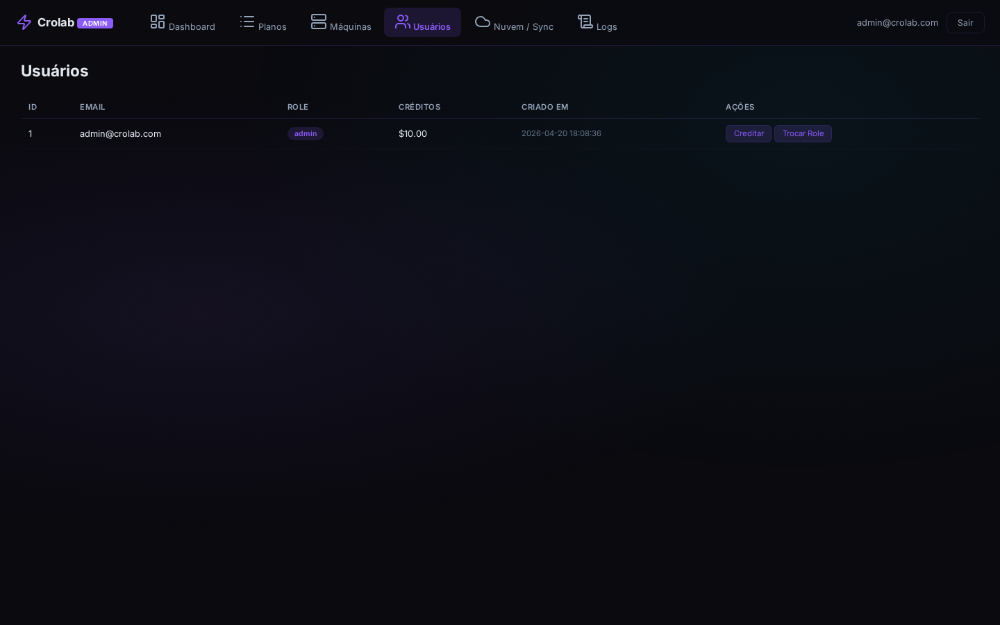
- **Sys Logs:** 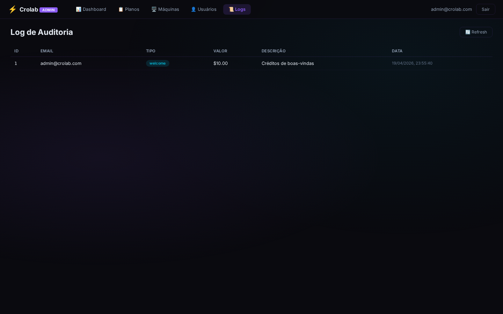
